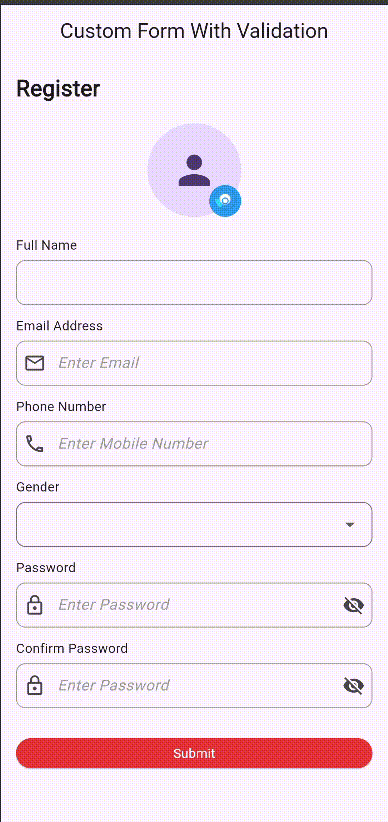

# Custom Form With Validation

A highly customizable Flutter form package with built-in validation, profile image picker, gender selection, date picker, terms & conditions support, and dynamic form fields.

## Features

✅ Full Name Validation

✅ Email Validation

✅ Mobile Number Validation

✅ Password Validation

✅ Confirm Password Validation

✅ Gender Dropdown

✅ Custom Gender Options

✅ Profile Image Picker

✅ Address Field

✅ Date Of Birth Picker

✅ Terms & Conditions Validation

✅ Loading State Support

✅ Custom Labels

✅ Custom Styling

✅ Form Data Callback

✅ Dynamic Field Visibility

✅ Responsive Scrollable Layout

---

## Installation

Add dependency in `pubspec.yaml`

```yaml
dependencies:
  library_flutter_form_validation: latest_version
```

Then run:

```bash
flutter pub get
```

---

## Import

```dart
import 'package:library_flutter_form_validation/form_validation/customformvalidation.dart';
```

---

## Basic Usage

```dart
CustomFormWithValidation(
  pageTitle: "Register",

  fullNametxtCtrl: fullNameCtrl,
  emailtxtCtrl: emailCtrl,
  phoneNumberCtrl: phoneCtrl,
  passwordCtrl: passwordCtrl,
  cnfPasswordCtrl: confirmPasswordCtrl,

  onSubmit: () {
    print("Form Submitted");
  },
)
```

---

## Complete Example

```dart
CustomFormWithValidation(
  pageTitle: "Create Account",
  subTitle: "Fill all required information",

  fullNametxtCtrl: fullNameCtrl,
  emailtxtCtrl: emailCtrl,
  phoneNumberCtrl: phoneCtrl,
  passwordCtrl: passwordCtrl,
  cnfPasswordCtrl: confirmPasswordCtrl,

  addressCtrl: addressCtrl,
  dobCtrl: dobCtrl,

  showProfilePhoto: true,
  showAddress: true,
  showDob: true,
  showTermsAndConditions: true,

  genderOptions: const [
    "Male",
    "Female",
    "Other",
  ],

  submitButtonText: "Register",

  onSubmit: () {
    print("Form Submitted");
  },

  onFormData: (data) {
    print(data);
  },
)
```

---

## Constructor Parameters

| Parameter              | Type                           | Description                 |
| ---------------------- | ------------------------------ | --------------------------- |
| pageTitle              | String                         | Form title                  |
| subTitle               | String                         | Form subtitle               |
| fullNametxtCtrl        | TextEditingController          | Full name controller        |
| emailtxtCtrl           | TextEditingController          | Email controller            |
| phoneNumberCtrl        | TextEditingController          | Phone controller            |
| passwordCtrl           | TextEditingController          | Password controller         |
| cnfPasswordCtrl        | TextEditingController          | Confirm password controller |
| addressCtrl            | TextEditingController?         | Address controller          |
| dobCtrl                | TextEditingController?         | DOB controller              |
| onSubmit               | VoidCallback?                  | Submit callback             |
| onFormData             | Function(Map<String,dynamic>)? | Returns form data           |
| showFullName           | bool                           | Show full name field        |
| showEmail              | bool                           | Show email field            |
| showPhone              | bool                           | Show phone field            |
| showPassword           | bool                           | Show password field         |
| showConfirmPassword    | bool                           | Show confirm password field |
| showGender             | bool                           | Show gender dropdown        |
| showAddress            | bool                           | Show address field          |
| showDob                | bool                           | Show DOB picker             |
| showProfilePhoto       | bool                           | Show profile image picker   |
| showTermsAndConditions | bool                           | Show terms checkbox         |
| genderOptions          | List<String>                   | Custom gender options       |
| initialGender          | String?                        | Default selected gender     |
| isLoading              | bool                           | Show loading state          |
| submitButtonText       | String                         | Button text                 |
| fieldSpacing           | double                         | Space between fields        |
| buttonColor            | Color?                         | Submit button color         |
| buttonTextColor        | Color?                         | Submit button text color    |
| titleStyle             | TextStyle?                     | Title styling               |
| subtitleStyle          | TextStyle?                     | Subtitle styling            |
| labelStyle             | TextStyle?                     | Label styling               |

---

## Form Data Callback

```dart
onFormData: (data) {
  print(data["fullName"]);
  print(data["email"]);
  print(data["phone"]);
  print(data["gender"]);
  print(data["address"]);
  print(data["dob"]);
  print(data["profileImage"]);
}
```

---

## Profile Image Picker

```dart
showProfilePhoto: true,

onImageSelected: (file) {
  print(file?.path);
}
```

---

## Gender Dropdown

```dart
genderOptions: const [
  "Male",
  "Female",
  "Other",
  "Prefer Not To Say",
]
```

---

## Date Of Birth Picker

```dart
showDob: true,
dobCtrl: dobController,
```

---

## Terms & Conditions

```dart
showTermsAndConditions: true,
```

Users must accept the terms before form submission.

---

## Validation Included

### Full Name

* Required field validation

### Email

* Email format validation

### Mobile Number

* Numeric validation
* Length validation

### Password

* Required validation
* Minimum length validation

### Confirm Password

* Password matching validation

### Gender

* Required selection validation

### Date Of Birth

* Required date selection validation

---


---

## Demo GIF

```md

```

---

## License

MIT License

Copyright (c) 2026 Excelsior Technologies

Permission is hereby granted, free of charge, to any person obtaining a copy
of this software and associated documentation files (the "Software"), to deal
in the Software without restriction, including without limitation the rights
to use, copy, modify, merge, publish, distribute, sublicense, and/or sell
copies of the Software, and to permit persons to whom the Software is
furnished to do so, subject to the following conditions:

The above copyright notice and this permission notice shall be included in all
copies or substantial portions of the Software.

THE SOFTWARE IS PROVIDED "AS IS", WITHOUT WARRANTY OF ANY KIND, EXPRESS OR
IMPLIED, INCLUDING BUT NOT LIMITED TO THE WARRANTIES OF MERCHANTABILITY,
FITNESS FOR A PARTICULAR PURPOSE AND NONINFRINGEMENT. IN NO EVENT SHALL THE
AUTHORS OR COPYRIGHT HOLDERS BE LIABLE FOR ANY CLAIM, DAMAGES OR OTHER
LIABILITY, WHETHER IN AN ACTION OF CONTRACT, TORT OR OTHERWISE, ARISING FROM,
OUT OF OR IN CONNECTION WITH THE SOFTWARE OR THE USE OR OTHER DEALINGS IN THE
SOFTWARE.
